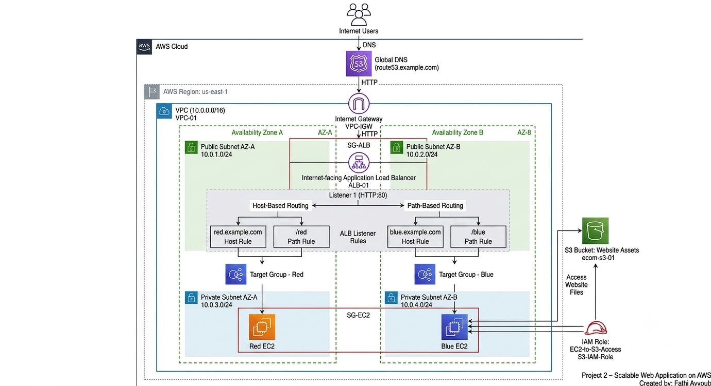

# Scalable Web Application on AWS with Advanced Request Routing

A production-style AWS Solutions Architecture portfolio project demonstrating the design, deployment, and documentation of a scalable web application on Amazon Web Services (AWS).

The solution implements high availability using an Application Load Balancer (ALB), multiple Amazon EC2 instances deployed across different Availability Zones, Amazon Route 53 DNS integration with a custom domain, and advanced request routing using both **host-based** and **path-based** routing rules.
lemented using the AWS Management Console and subsequently reverse-engineered into
The infrastructure was imp **Terraform** to provide Infrastructure as Code (IaC), making the solution easier to understand, version control, and reproduce.

> **Status:** ✅ Completed
>
> ---

# Business Scenario

An organization hosts multiple web applications under a single domain and requires an efficient way to route users to different application environments without deploying separate load balancers for each service.

The solution must:

- Provide high availability across multiple Availability Zones.
- Support both URL path-based and subdomain-based request routing.
- Simplify DNS management using a single custom domain.
- Be scalable to support future application growth.
- Follow Infrastructure as Code (IaC) principles for maintainability and repeatability.

- ---
# Project Objectives

The objectives of this project were to:

- Design and deploy a scalable web application on AWS.
- Implement high availability by distributing resources across multiple Availability Zones.
- Configure an Application Load Balancer (ALB) to perform both path-based and host-based request routing.
- Integrate Amazon Route 53 with a custom domain for DNS resolution.
- Secure application access using Security Groups and IAM roles following the principle of least privilege.
- Store and serve website assets from Amazon S3.
- Reverse-engineer the deployed infrastructure into Terraform to demonstrate Infrastructure as Code (IaC) best practices.
- Produce professional documentation and project artifacts suitable for an AWS Solutions Architect portfolio.

- ---

# Solution Architecture

The solution follows a highly available, multi-tier AWS architecture designed to distribute incoming web traffic across multiple Amazon EC2 instances deployed in separate Availability Zones.

Users access the application through a custom domain managed by Amazon Route 53. DNS requests are forwarded to an internet-facing Application Load Balancer (ALB), which evaluates listener rules and routes traffic based on either the requested URL path or the requested host header (subdomain).

The backend application consists of two Amazon EC2 instances (Red and Blue), each serving different web content. Website assets are stored in Amazon S3 and retrieved securely by the EC2 instances using an IAM role with least-privilege permissions.

Following the successful deployment, the infrastructure was reverse-engineered into Terraform to provide Infrastructure as Code (IaC), allowing the environment to be version controlled, documented, and reproduced using industry-standard practices.

---

# AWS Services Used

| AWS Service | Purpose |
|-------------|---------|
| Amazon EC2 | Hosts the Red and Blue web applications. |
| Application Load Balancer (ALB) | Distributes incoming traffic and performs path-based and host-based request routing. |
| Amazon Route 53 | Provides DNS hosting and routes the custom domain to the Application Load Balancer. |
| Amazon S3 | Stores static website assets accessed by the EC2 instances. |
| AWS Identity and Access Management (IAM) | Provides secure access for EC2 instances to retrieve files from Amazon S3 using an IAM role. |
| Amazon VPC | Provides network isolation for the application infrastructure. |
| Security Groups | Control inbound and outbound network traffic. |
| Terraform | Represents the deployed infrastructure as Infrastructure as Code (IaC). |

---

# Architecture Diagram

The following diagram illustrates the overall AWS architecture implemented for this project.

> **Note:** The architecture was designed to demonstrate high availability, advanced request routing, secure access to Amazon S3 using IAM roles, and DNS integration through Amazon Route 53.

